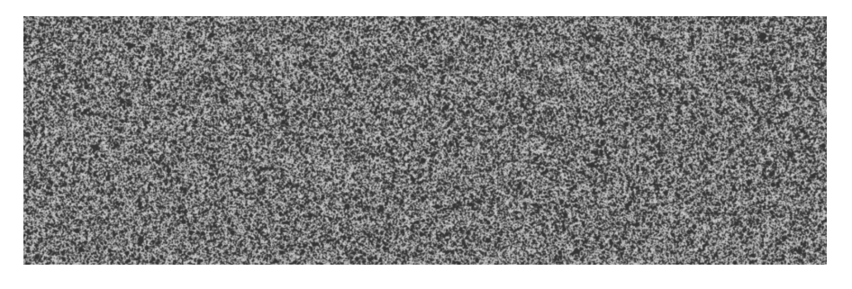
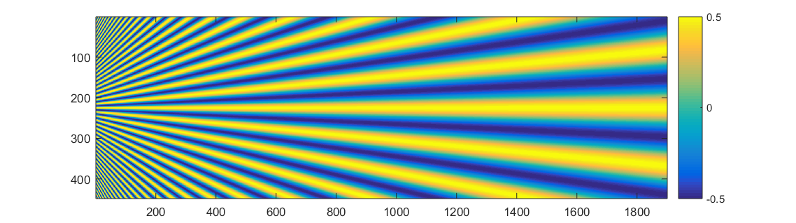
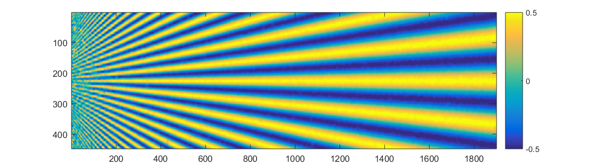
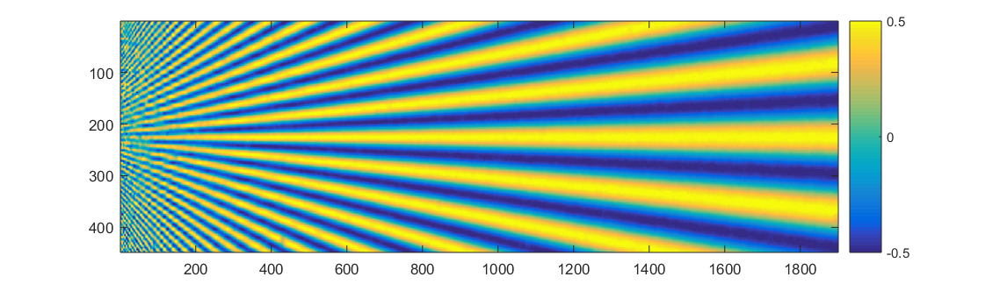

# StrainNet (Pytorch implementation)

StrainNet estimates subpixelic displacement and strain fields from pairs of reference and deformed images of a flat speckled surface, as Digital Image Correlation (DIC) does. See paper [1] for details. 

If you find this implementation useful, please cite the papers [1]. Also, make sure to adhere to the licensing terms of the authors. 

## Prerequisite

Install the following modules: 

```
pytorch >= 1.2
torchvision
tensorboardX 
imageio
argparse
path.py
numpy
pandas
tqdm
```

<!---
## Training
1. Generate Speckle dataset [1.0](Dataset/Speckle%20dataset%201.0) or [2.0](Dataset/Speckle%20dataset%202.0)
2. Specify the Train and Test dataset paths in Train.py (in train_set and test_set)
3. Execute the following commands
```
python Train.py --arch StrainNet_h 
python Train.py --arch StrainNet_f
```
-->

## Running inference

The images pairs should be in the same location, with the name pattern *1.ext  *2.ext

```bash
python inference.py /path/to/input/images/  --arch StrainNet_h  --pretrained /path/to/pretrained/model
python inference.py /path/to/input/images/  --arch StrainNet_f  --pretrained /path/to/pretrained/model  
```

## Pretrained Models

The pretrained models of StrainNet-h and StrainNet_f are available [here](https://drive.google.com/drive/folders/1eh2h6ysikk87L_uad8NNt4FpEq7BSN9M?usp=sharing) 

## Results of star images

Execute the following commands

```bash
python inference.py /Star_frames/Noiseless_frames/  --arch StrainNet_h  --pretrained StrainNet-h.pth.tar
python inference.py /Star_frames/Noiseless_frames/  --arch StrainNet_f  --pretrained StrainNet-f.pth.tar
```
You can use Script_flow.m to visualize the obtained displacements 

|Reference image   |    |
|:----------:|:---------------------------------------------:|
|Reference displacement   |   |
|Retrieved by StrainNet-h  | |
|Retrieved by StrainNet-f | |


## References 
[1] S. Boukhtache, K. Abdelouahab, F. Berry, B. Blaysat, M. Grédiac and F. Sur. *"When Deep Learning Meets Digital Image Correlation"*, Accepeted for publication in *Optics and Lasers in Engineering*, Elsevier 2020.  

## Acknowledgments

This code is based on the Pytorch impelmentation of FlowNetS from [FlowNetPytorch](https://github.com/ClementPinard/FlowNetPytorch)
